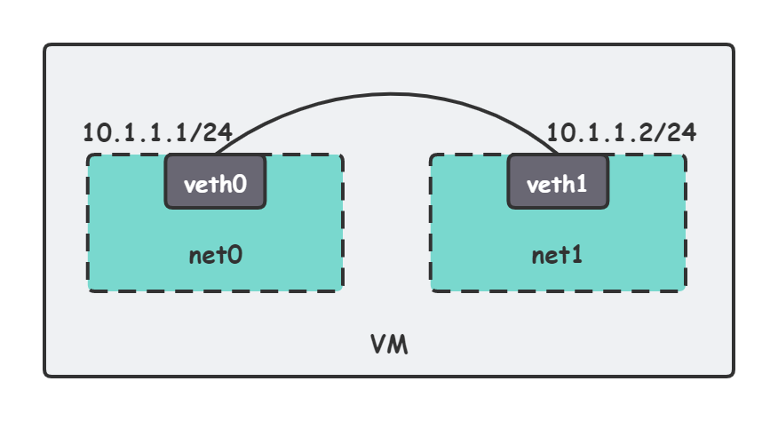
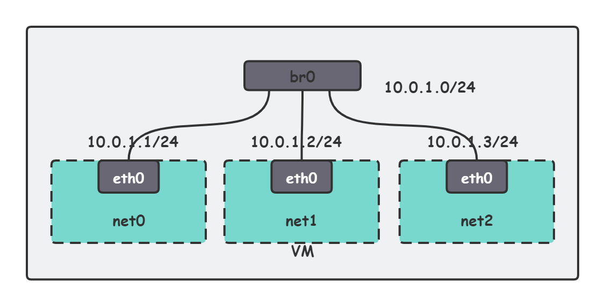

>参考来源：
>
>https://www.cnblogs.com/bakari/p/10443484.html#406017600


# Linux network namespace：ip命令

和Linux network namespace相关的操作子命令为`ip netns`、`ip link`

## 创建net namespace

```shell
[root@control-plane ~]# ip netns add net1
[root@control-plane ~]# ip netns ls
net1
```

## 进入net namespace

```shell
[root@control-plane ~]# ip netns exec net1 ip addr
1: lo: <LOOPBACK> mtu 65536 qdisc noop state DOWN group default qlen 1000
    link/loopback 00:00:00:00:00:00 brd 00:00:00:00:00:00
[root@control-plane ~]# ip netns exec net1 bash
[root@control-plane ~]# ip addr
1: lo: <LOOPBACK> mtu 65536 qdisc noop state DOWN group default qlen 1000
    link/loopback 00:00:00:00:00:00 brd 00:00:00:00:00:00
[root@control-plane ~]# exit
exit
```

## 两个net namespace间通信

两个network namespace之间通信，可以借助虚拟网络设备veth pair。拓扑图如下：



### 创建veth pair

```shell
[root@control-plane ~]# ip link add type veth
[root@control-plane ~]# ip link
14: veth0@veth1: <BROADCAST,MULTICAST,M-DOWN> mtu 1500 qdisc noop state DOWN mode DEFAULT group default qlen 1000
    link/ether 5a:b3:38:ff:19:68 brd ff:ff:ff:ff:ff:ff
15: veth1@veth0: <BROADCAST,MULTICAST,M-DOWN> mtu 1500 qdisc noop state DOWN mode DEFAULT group default qlen 1000
    link/ether 76:fe:86:96:87:e4 brd ff:ff:ff:ff:ff:ff
```

可以看到，veth pair总是成对出现的，使用命令 `ip link add xxx type veth peer name yyy` 指定 veth pair 的两个网络接口名。

### 将veth pair加入net namespace

```shell
[root@control-plane ~]# ip link set veth0 netns net0
[root@control-plane ~]# ip link set veth1 netns net1
[root@control-plane ~]# ip netns exec net0 ip addr
1: lo: <LOOPBACK> mtu 65536 qdisc noop state DOWN group default qlen 1000
    link/loopback 00:00:00:00:00:00 brd 00:00:00:00:00:00
14: veth0@if15: <BROADCAST,MULTICAST> mtu 1500 qdisc noop state DOWN group default qlen 1000
    link/ether 5a:b3:38:ff:19:68 brd ff:ff:ff:ff:ff:ff link-netnsid 1
```

可以看到，net interface接入namespace后，初始状态为DOWN。

### 给veth pair配上IP地址

```shell
[root@control-plane ~]# ip netns exec net0 ip link set veth0 up 
[root@control-plane ~]# ip netns exec net0 ip addr add 10.1.1.1/24 dev veth0
[root@control-plane ~]# ip netns exec net0 ip route 
10.1.1.0/24 dev veth0 proto kernel scope link src 10.1.1.1
[root@control-plane ~]# ip netns exec net1 ip link set veth1 up
[root@control-plane ~]# ip netns exec net1 ip addr add 10.1.1.2/24 dev veth1
[root@control-plane ~]# ip netns exec net1 ip route 
10.1.1.0/24 dev veth1 proto kernel scope link src 10.1.1.2
```

可以看到，配置完IP地址后，自动生成了路由信息。


### 测试连通性

```shell
[root@control-plane ~]# ip netns exec net0 ping 10.1.1.2
PING 10.1.1.2 (10.1.1.2) 56(84) bytes of data.
64 bytes from 10.1.1.2: icmp_seq=1 ttl=64 time=0.055 ms
64 bytes from 10.1.1.2: icmp_seq=2 ttl=64 time=0.042 ms
```


## 多个net namespace之间通信

两个namespace之间通信可以借助veth pair，多个net namespace之间的通信则更适合用bridge来转接。拓扑图如下：



### 使用ip link和brctl创建bridge

```shell
[root@control-plane ~]# ip link add br0 type bridge 
[root@control-plane ~]# ip link set dev br0 up
[root@control-plane ~]# ip link
16: br0: <BROADCAST,MULTICAST,UP,LOWER_UP> mtu 1500 qdisc noqueue state UNKNOWN mode DEFAULT group default qlen 1000
    link/ether 2e:ea:a9:1e:70:3b brd ff:ff:ff:ff:ff:ff
```

### 创建veth pair

```shell
[root@control-plane ~]# ip link add type veth
[root@control-plane ~]# ip link add type veth
[root@control-plane ~]# ip link add type veth
```

### 将veth pair的一端挂到namespace，另一端挂到bridge

```shell
[root@control-plane ~]# ip link set dev veth1 netns net0
[root@control-plane ~]# ip netns exec net0 ip link set dev veth1 name eth0
[root@control-plane ~]# ip netns exec net0 ip addr add 10.0.1.1/24 dev eth0
[root@control-plane ~]# ip netns exec net0 ip link set dev eth0 up

[root@control-plane ~]# ip link set dev veth0 master br0
[root@control-plane ~]# ip link set dev veth0 up


[root@control-plane ~]# ip link set dev veth3 netns net1
[root@control-plane ~]# ip netns exec net1 ip link set dev veth3 name eth0
[root@control-plane ~]# ip netns exec net1 ip addr add 10.0.1.2/24 dev eth0
[root@control-plane ~]# ip netns exec net1 ip link set dev eth0 up

[root@control-plane ~]# ip link set dev veth2 master br0
[root@control-plane ~]# ip link set dev veth2 up


[root@control-plane ~]# ip link set dev veth5 netns net2
[root@control-plane ~]# ip netns exec net2 ip link set dev veth5 name eth0
[root@control-plane ~]# ip netns exec net2 ip addr add 10.0.1.3/24 dev eth0
[root@control-plane ~]# ip netns exec net2 ip link set dev eth0 up

[root@control-plane ~]# ip link set dev veth4 master br0
[root@control-plane ~]# ip link set dev veth4 up
```

### 测试连通性

```shell
[root@control-plane ~]# ip netns exec net0 ping 10.0.1.2
PING 10.0.1.2 (10.0.1.2) 56(84) bytes of data.
64 bytes from 10.0.1.2: icmp_seq=1 ttl=64 time=0.075 ms
64 bytes from 10.0.1.2: icmp_seq=2 ttl=64 time=0.059 ms
^C
--- 10.0.1.2 ping statistics ---
2 packets transmitted, 2 received, 0% packet loss, time 999ms
rtt min/avg/max/mdev = 0.059/0.067/0.075/0.008 ms

[root@control-plane ~]# ip netns exec net0 ping 10.0.1.3
PING 10.0.1.3 (10.0.1.3) 56(84) bytes of data.
64 bytes from 10.0.1.3: icmp_seq=1 ttl=64 time=0.105 ms
64 bytes from 10.0.1.3: icmp_seq=2 ttl=64 time=0.049 ms
^C
--- 10.0.1.3 ping statistics ---
2 packets transmitted, 2 received, 0% packet loss, time 999ms
rtt min/avg/max/mdev = 0.049/0.077/0.105/0.028 ms
```

上述数据表明，三个network namespace之间可以互相访问。

