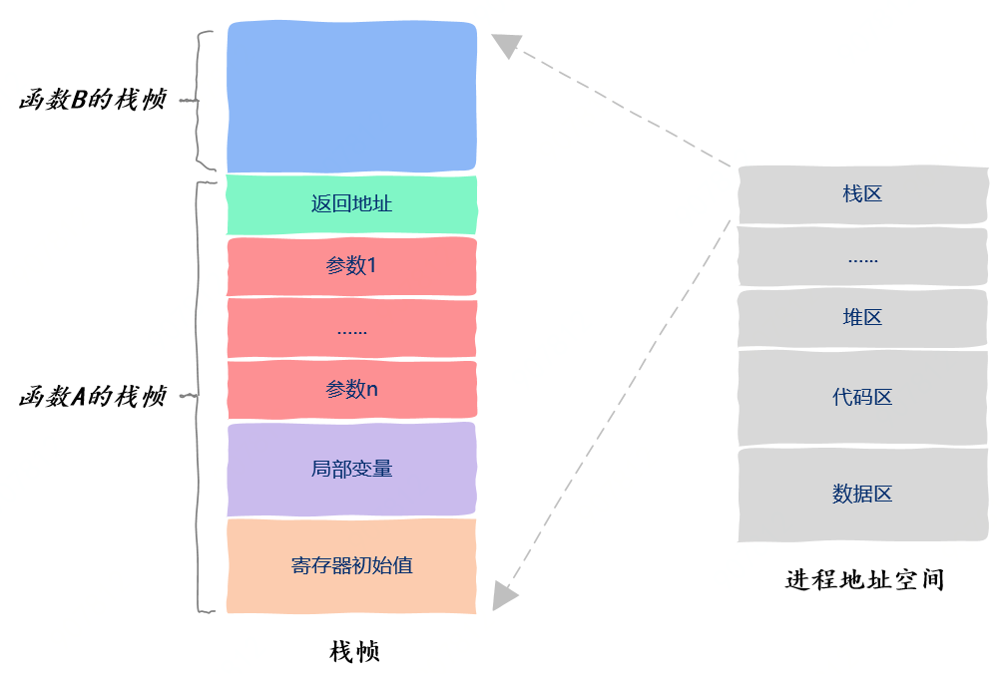

> 参考来源：
>
> https://mp.weixin.qq.com/s/KFpY1mZSy-KhdMDg3C328g


# 线程间共享了哪些资源

## 线程私有资源（线程上下文）

线程运行的本质其实就是函数的执行，函数的执行是有源头的，这个源头就是入口函数，CPU从入口函数开始执行从而形成一个执行流，我们人为地给这个执行流赋予一个名字，这个名字就叫线程。

所属线程的**栈区、程序计数器、栈指针以及函数运行使用的寄存器**是线程私有的。这些信息有一个统一的名字，叫线程上下文（Thread context）。

### 栈帧

我们知道，函数运行时的信息保存在栈帧中，栈帧中保存了函数的返回值、调用其他函数的参数、该函数使用的局部变量以及该函数使用的寄存器信息。



### 程序计数器

此外，CPU执行指令的信息保存在一个叫做程序计数器的寄存器中，通过这个寄存器我们就知道接下来要执行哪一条指令。

### 寄存器

由于操作系统随时可以暂停线程的运行，因此我们保存以及恢复程序计数器中的值就能知道线程是从哪里暂停的以及该从哪里继续运行了。

### 线程局部存储（Thread Local Storage）

所谓线程局部存储，是指存放在该区域中的变量有两个含义：

- 存放在该区域中的变量是全局变量，所有线程都可以访问
- 虽然看上去所有线程访问的都是同一个变量，但该全局变量独属于一个线程，一个线程对此变量的修改对其他线程不可见。

在C++中，线程局部存储变量使用`__thread`修饰。线程局部存储可以让我们使用一个独属于线程的全局变量。也就是说，虽然该变量可以被所有线程访问，但该变量在每个线程中都有一个副本，一个线程对改变量的修改不会影响到其它线程。

## 线程共享资源

在进程的地址空间中，线程共享除了线程上下文外的所有内容。

### 代码区

代码区保存的是程序编译后的可执行机器指令，它是从可执行文件中加载到内存的。线程之间共享代码区，这就意味着任何一个函数都可以放到线程中去执行不存在某个函数只能被特定线程执行的情况。


### 数据区

数据区存放的全局变量，即定义在函数之外的变量。在程序运行期间（run time），数据区中的全局变量有且仅有一个实例，所有的线程都可以访问到该全局变量。


有一类特殊的变量——使用static关键词修饰的变量，它们虽然有可能定义在函数内部，但它们依然具备全局变量的特性，即使函数执行完后改变量依然存在。因此静态变量也是放在进程地址空间的数据区的。

### 堆区

堆区存放的是程序中通过动态申请内存得到的变量的存放位置。在堆区的变量，只要知道变量的地址，也就是指针，任何一个线程都可以访问指针指向的数据，数据进程的资源。


### 栈区

从抽象的概念上来说，栈区是线程私有的，但从实际的实现上来看，栈区属于线程私有这一规则并没有被严格遵守。

通常情况下，栈区是线程私有的，存在不通常情况的原因是，与进程地址空间之间的严格隔离不同，线程的栈区之间没有严格的隔离机制，也就是说，线程之间是存在相互修改数据的可能性的。


例如下面的代码:

```c
void thread(void* var) {
    int* p = (int*)var;
    *p = 2;
}

int main() {
    int a = 1;
    pthread_t tid;
    
    pthread_create(&tid, NULL, thread, (void*)&a);
    return 0;
}
```

首先我们在主线程的栈区定义了一个局部变量a，该变量属于主线程的私有数据。但接下来我们创建了一个新心线程，并把变量a的地址以参数的形式传递给新线程，在线程thread中，程序通过指针修改了变量a的值。也就是说，我们在新创建的线程中修改了本属于主线程的私有数据。

尽管栈区是线程的私有数据，但由于栈区没有添加任何保护机制，一个线程的栈区对其它线程是可以见的，也就是说我们可以修改属于任何一个线程的栈区。上面的这种做法在代码的角度是行得通的，但这种编码方式会给问题定位带来很大的困难。

### 动态链接库

可执行文件是由编译器生成的，这句话只对了一半。编译器在将可执行程序翻译成机器指令后，需要链接器链接目标文件后，才能生成可执行程序。


链接器有两种链接方式，静态链接和动态链接。

静态链接的意思是说把所有的机器指令一股脑全部打包到可执行程序中，动态链接的意思是我们不把动态丽娜姐的部分打包到可执行程序，而是在可执行程序运行起来后去内存中找动态链接的那部分代码。动态链接一个显而易见的好处就是可执行文件会比较小，而动态链接的部分生成的库就是我们熟悉的动态链接库，在Windows下是以`dll`结尾的文件，而在Linux下是以`so`结尾的文件。


如果一个应用程序是通过动态链接方式生成的，那么在其地址空间中有一部分包含的就是动态链接库，否则程序无法运行，这一部分空间也是被所有线程共享的。

### 打开的文件

如果程序在运行过程中打开了一些文件，那么进程地址空间中还保存有打开的文件信息，它们也可以被所有线程共享使用。

